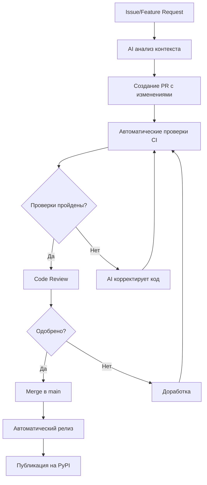

# autonomous-dev

[](https://github.com/rissottipaul-boop/AI-PRO/actions)
[](https://www.python.org/downloads/)
[](LICENSE)
[](https://github.com/psf/black)
[](https://github.com/astral-sh/ruff)

Автономная заготовка репозитория для быстрой AI-ассистируемой разработки.

## 📋 О проекте

**autonomous-dev** — это полнофункциональный шаблон Python-проекта с полной автоматизацией разработки, тестирования, безопасности и развертывания. Проект включает в себя передовые практики DevOps, CI/CD, а также уникальные возможности саамообучения и оптимизации производительности.

### Ключевые особенности

- 🤖 **AI-ассистируемая разработка**: Интеграция с GitHub Copilot и MCP-сервером
- 🧪 **Полное покрытие тестами**: pytest с минимальным порогом 85%
- 🔒 **Безопасность на всех уровнях**: автоматический аудит зависимостей, SAST, секрет-сканирование
- 📊 **Система метрик**: отслеживание качества, производительности и трендов
- 🚀 **Автоматические релизы**: публикация на PyPI через OIDC trusted publishing
- 🔄 **Циклы обратной связи**: непрерывное улучшение на основе данных
- 🐳 **Dev Container**: воспроизводимая среда разработки

### Технологический стек

- **Язык**: Python 3.11+
- **Тестирование**: pytest, pytest-cov
- **Линтеры**: Ruff, Black, mypy
- **Безопасность**: bandit, pip-audit, gitleaks, CodeQL
- **CI/CD**: GitHub Actions
- **Зависимости**: Dependabot
- **Документация**: Markdown, ADR (Architecture Decision Records)
- **Контейнеризация**: Docker, Dev Container

## Возможности

### Базовые

- Тестирование (pytest + coverage, порог 85%)
- CI (GitHub Actions) — matrix (3.11, 3.12, 3.13) + отдельный security job

- Automation Policy (`automation_policy.yaml`)
- Dependabot (pip + actions)
- Release workflow (build + publish на PyPI по main через OIDC trusted publishing)
- Makefile и PowerShell скрипт для Windows
- VSCode задачи и настройки
- ADR и архитектурная документация
- Политика безопасности (SECURITY.md)

### Саамообучение и производительность 🚀
- **Система метрик**: отслеживание и анализ показателей разработки
- **Анализ трендов**: автоматическое выявление паттернов и проблем
- **Генерация инсайтов**: предложения по улучшению на основе данных
- **Циклы обратной связи**: непрерывное улучшение процессов
- **Профилирование**: мониторинг производительности операций
- **Кэширование**: оптимизация дорогих вычислений
- **Батчинг и параллелизация**: эффективная обработка данных


## ⚙️ CI/CD Workflows

### Основные workflows

#### 1. CI Pipeline (`ci.yml`)

Запускается на каждый push и pull request:

**Matrix testing**:
- Python 3.11, 3.12, 3.13
- Ubuntu latest

**Проверки**:
```bash
- Установка зависимостей
- Линтинг (ruff)
- Форматирование (black)
- Проверка типов (mypy)
- Тесты (pytest)
- Покрытие кода (codecov)
```

**Security job** (отдельный):
```bash
- pip-audit (уязвимости)
- bandit (SAST)
- deptry (неиспользуемые deps)
- SBOM generation (CycloneDX)
```

#### 2. Release Pipeline (`release.yml`)

Автоматическая публикация на PyPI:
- Триггер: изменение версии в `pyproject.toml`
- OIDC trusted publishing
- Создание GitHub Release
- Генерация changelog

#### 3. Nightly Checks (`nightly.yml`)

Расширенные проверки каждую ночь:
- Полный security аудит
- Performance benchmarks
- Проверка последних версий зависимостей
- Extended test suite

#### 4. CodeQL Analysis (`codeql.yml`)

Семантический анализ безопасности:
- Python security patterns
- Ежедневное сканирование
- Автоматические security advisories

#### 5. Version Check (`version-check.yml`)

Валидация семантического версионирования:
- Проверка формата версии
- Валидация changelog
- Соответствие SemVer

#### 6. Changelog Generation (`changelog.yml`)

Автоматическое обновление CHANGELOG.md:
- Парсинг conventional commits
- Группировка по типам изменений
- Связывание с issues и PRs

### Статус проверок

Все workflows должны быть зелёными для merge:

| Workflow | Статус | Описание |
|----------|--------|----------|
| CI | ✅ Required | Тесты, линт, типы |
| Security | ✅ Required | Аудит безопасности |
| CodeQL | 🔍 Advisory | Deep security analysis |
| Version | ✅ Required | Валидация версии |

## 🚀 Быстрый старт

```bash
# (опционально) создать виртуальное окружение (Linux/macOS)
python -m venv .venv
source .venv/bin/activate
```

PowerShell (Windows):

```powershell
python -m venv .venv
./.venv/Scripts/Activate.ps1
```

CMD (Windows):

```bat
python -m venv .venv
.\.venv\Scripts\activate.bat
```

Далее общие шаги:

```bash
# Установка dev зависимостей
pip install .[dev]

# Запуск тестов
pytest -q

# Линт + типы
ruff check . && mypy src/autonomous_dev
```

PowerShell скрипт:

```powershell
pwsh -File scripts/dev.ps1 -All
```

Makefile (Linux/macOS):

```bash
make install
make all
```

## 💡 Примеры использования

### Система саамообучения

```python
from autonomous_dev.learning import MetricsTracker, FeedbackLoop

# Отслеживание метрик
tracker = MetricsTracker()
tracker.record_metric("test_duration", 12.5, {"suite": "unit"})
tracker.record_metric("coverage", 89.5, {"module": "core"})

# Анализ и получение инсайтов
feedback = FeedbackLoop(tracker)
insights = feedback.evaluate_iteration({
    "task_type": "feature",
    "duration": 45.0,
    "tests_passed": True
})

for insight in insights:
    print(f"{insight.category}: {insight.description}")
    print(f"Действие: {insight.suggested_action}")
    print(f"Приоритет: {insight.priority}")
```

### Оптимизация производительности

```python
from autonomous_dev.performance import PerformanceMonitor, SimpleCache

# Профилирование операций
with PerformanceMonitor("expensive_operation") as monitor:
    # Ваш код
    result = perform_computation()

print(f"Время выполнения: {monitor.get_latest_duration():.2f}s")

# Кэширование
cache = SimpleCache(maxsize=100)

@cache.cached
def expensive_function(x: int) -> int:
    return x ** 2

# Первый вызов - вычисление
result1 = expensive_function(5)  # Вычисляется

# Второй вызов - из кэша
result2 = expensive_function(5)  # Из кэша
```

### Интеграция в CI/CD

```python
# В вашем CI скрипте
from autonomous_dev.learning import MetricsTracker
import time

tracker = MetricsTracker()

# Записываем метрики CI
start = time.time()
run_tests()
duration = time.time() - start

tracker.record_metric("ci_duration", duration, {
    "branch": os.environ.get("GITHUB_REF"),
    "python_version": sys.version
})

# Сохранение метрик для анализа
tracker.save_metrics("metrics.json")
```

## Pre-commit

```bash
pre-commit install
pre-commit run --all-files
```

## 📁 Структура проекта

```text
autonomous-dev/
├── .github/                      # GitHub конфигурация
│   ├── workflows/                # CI/CD workflows
│   │   ├── ci.yml               # Основной CI пайплайн
│   │   ├── release.yml          # Автоматическая публикация
│   │   ├── nightly.yml          # Расширенные ночные проверки
│   │   ├── codeql.yml           # CodeQL анализ безопасности
│   │   ├── changelog.yml        # Автогенерация changelog
│   │   └── version-check.yml    # Валидация версий
│   ├── ISSUE_TEMPLATE/          # Шаблоны issues
│   ├── COPILOT_INSTRUCTIONS.md  # Инструкции для AI
│   └── PULL_REQUEST_TEMPLATE.md # Шаблон PR
├── .devcontainer/               # Dev Container конфигурация
├── DECISIONS/                    # Architecture Decision Records
│   ├── ADR-0001-initial-architecture.md
│   └── ADR-0002-self-learning-performance.md
├── src/autonomous_dev/          # Исходный код
│   ├── __init__.py
│   ├── example.py               # Примеры использования
│   ├── learning.py              # Система саамообучения
│   └── performance.py           # Оптимизация производительности
├── tests/                        # Тесты
│   ├── test_example.py
│   ├── test_learning.py
│   └── test_performance.py
├── scripts/                      # Вспомогательные скрипты
│   └── dev.ps1                  # PowerShell скрипт для Windows
├── pyproject.toml               # Конфигурация проекта и зависимости
├── automation_policy.yaml       # Политика автоматизации
├── roadmap.yaml                 # Дорожная карта развития
├── mcp.json                     # Конфигурация MCP сервера
├── Makefile                     # Команды для разработки (Linux/macOS)
├── .pre-commit-config.yaml      # Pre-commit хуки
├── .gitcliff.toml              # Конфигурация changelog
├── codecov.yml                  # Настройки Codecov
├── ARCHITECTURE.md              # Архитектура проекта
├── AUTOMATION_GUIDE.md          # Руководство по автоматизации
├── SELF_LEARNING_GUIDE.md       # Руководство по саамообучению
├── SECURITY.md                  # Политика безопасности
├── CODE_OF_CONDUCT.md           # Кодекс поведения
├── CHANGELOG.md                 # История изменений
├── LICENSE                      # MIT лицензия
└── README.md                    # Этот файл
```

## 🤖 Автономный рабочий цикл AI

Проект оптимизирован для работы с AI-ассистентами (GitHub Copilot, Claude, ChatGPT):

### Поддержка AI-агентов

1. **Структурированные задачи**: шаблоны issues для агентов в `.github/ISSUE_TEMPLATE/`
2. **Контрактные инструкции**: `.github/COPILOT_INSTRUCTIONS.md` содержит полные гайдлайны
3. **Политика автоматизации**: `automation_policy.yaml` определяет что можно менять автоматически
4. **Дорожная карта**: `roadmap.yaml` для планирования задач
5. **ADR документация**: Architecture Decision Records для контекста решений

### Рабочий цикл



### Интеграция MCP

Model Context Protocol (MCP) обеспечивает прямой доступ к GitHub API для AI-агентов:

- Чтение и создание issues
- Работа с pull requests
- Анализ кода и изменений
- Запуск и мониторинг workflows


## Политика автоматизации

Файл `automation_policy.yaml` задаёт:

- Порог покрытия: 85%
- Жёсткий линт (0 ошибок)
- Что разрешено авто-мерджить (dev deps patch, форматирование)
- Что требует ревью (public API, major bump, ADR изменения)

## 🔒 Безопасность

Многоуровневая система безопасности:

### Автоматические проверки

- **pip-audit**: сканирование известных уязвимостей в зависимостях (HIGH severity = fail)
- **bandit**: статический анализ Python кода на security issues
- **gitleaks**: обнаружение секретов и приватных ключей в коммитах
- **CodeQL**: семантический анализ безопасности от GitHub
- **deptry**: проверка неиспользуемых и скрытых зависимостей
- **SBOM (CycloneDX)**: генерируется в CI для каждого билда

### Pre-commit защита

```bash
pre-commit install
```

Автоматически запускаются перед каждым коммитом:
- Форматирование кода (black, ruff)
- Проверка типов (mypy)
- Сканирование секретов (gitleaks)
- Проверка YAML/JSON синтаксиса

### Политика безопасности

- **Dependabot**: еженедельное обновление зависимостей
- **Minimum Python 3.11**: использование современных security features
- **Pinned versions**: все GitHub Actions закреплены на конкретных версиях
- **Least privilege**: минимальные права для CI/CD jobs

### Отчетность

- Email уведомления при обнаружении уязвимостей
- GitHub Security advisories
- Подробная документация в [SECURITY.md](SECURITY.md)

### Известные решенные проблемы

⚠️ **SSH Keys** (Resolved): Случайно закоммиченные SSH ключи были удалены, `.gitignore` обновлён для предотвращения повторения.

## 📦 Управление зависимостями

### Автоматические обновления

**Dependabot** настроен на еженедельную проверку обновлений:

- **Python пакеты** (pip): каждую неделю в понедельник
- **GitHub Actions**: каждую неделю в понедельник

### Политика обновлений

Согласно `automation_policy.yaml`:

**Автоматический merge** (при зелёных тестах):
- Patch обновления dev-зависимостей (0.0.x)
- Форматирование и линтинг изменения
- Обновления security-аудитов

**Требует ревью**:
- Major версии (x.0.0) — breaking changes
- Изменения публичного API
- Обновления production зависимостей

### Инструменты

```bash
# Проверка на уязвимости
pip-audit

# Проверка неиспользуемых зависимостей
deptry .

# Обновление всех зависимостей (осторожно!)
pip install --upgrade -r requirements.txt
```

### Будущее

- Интеграция с Renovate для более гибкого управления
- Автоматические performance benchmarks для обновлений
- ML-предсказание безопасности обновлений

## 🚀 Релизы и публикация

### Автоматический процесс релиза

Workflow `release.yml` автоматически выполняет:

1. **Триггер**: изменение версии в `pyproject.toml` на ветке `main`
2. **Сборка**: создание wheel и source distribution
3. **Публикация**: загрузка на PyPI через OIDC trusted publishing
4. **Теги**: автоматическое создание git tags
5. **Changelog**: генерация истории изменений через git-cliff

### OIDC Trusted Publishing

**Без секретов!** Используется OpenID Connect для безопасной публикации:

```yaml
# Не нужны API токены или пароли
# GitHub аутентифицируется на PyPI напрямую
```

Преимущества:
- Нет риска утечки токенов
- Автоматическая ротация credentials
- Прозрачный audit trail
- Соответствие best practices

### Semantic Versioning

Проект следует [SemVer 2.0.0](https://semver.org/):

- **MAJOR** (x.0.0): breaking changes API
- **MINOR** (0.x.0): новые функции, обратная совместимость
- **PATCH** (0.0.x): багфиксы

### Changelog

Автоматически генерируется из conventional commits:

```bash
# Формат коммитов
feat: добавить новую функцию
fix: исправить баг
docs: обновить документацию
chore: технические изменения
```

### Процесс релиза

```bash
# 1. Обновить версию в pyproject.toml
version = "0.2.0"

# 2. Коммит и push в main
git add pyproject.toml
git commit -m "chore: bump version to 0.2.0"
git push origin main

# 3. GitHub Actions автоматически:
#    - Соберёт пакет
#    - Запустит тесты
#    - Опубликует на PyPI
#    - Создаст git tag
#    - Обновит CHANGELOG.md
```

## Архитектура и ADR

- `ARCHITECTURE.md` — обзор слоёв
- `AUTOMATION_GUIDE.md` — руководство по инфраструктуре автоматизации
- `SELF_LEARNING_GUIDE.md` — руководство по саамообучению и оптимизации
- `DECISIONS/ADR-0001-initial-architecture.md` — начальная архитектура
- `DECISIONS/ADR-0002-self-learning-performance.md` — система саамообучения

## Дорожная карта

`roadmap.yaml` хранит инициативы для планирования последующих автоматизаций.

## Документация для AI-агентов

- **[Copilot Instructions](.github/COPILOT_INSTRUCTIONS.md)** — полный контракт и гайдлайны
- **[Automation Guide](AUTOMATION_GUIDE.md)** — инфраструктура автоматизации
- **[Agent Task Template](.github/ISSUE_TEMPLATE/agent_task.yml)** — структурированные задачи
- **[Automation Policy](automation_policy.yaml)** — правила и пороги
- **[Architecture](ARCHITECTURE.md)** — архитектура системы
- **[Roadmap](roadmap.yaml)** — дорожная карта

## Расширения (потенциал)

- ✅ Devcontainer + Dockerfile
- ✅ Conventional commits (реализовано)
- ✅ Автогенерация changelog (git-cliff реализован)
- ✅ SBOM (CycloneDX в CI)
- ✅ Nightly workflow (расширенные проверки)
- ✅ Version checking (семантическая валидация)
- ChatOps команды (slash /qa /security)
- Performance benchmarks

## Dev Container

Среда разработки в контейнере обеспечивает воспроизводимость и унификацию инструментов.

### Запуск

1. Установить расширение VS Code: Dev Containers
2. Открыть папку репозитория в VS Code
3. Нажать: F1 → Dev Containers: Reopen in Container
4. Дождаться установки зависимостей и pre-commit хуков

### Что внутри контейнера

- Python 3.11 (venv в `/workspace/.venv`)
- Установлены dev зависимости (`.[dev]`)
- pre-commit хуки уже установлены
- Расширения VS Code (Python, Pylance, Ruff, Docker, GitHub Actions)
- docker-in-docker (опционально) для будущих интеграций

### Частые операции внутри контейнера

```bash
pytest -q
ruff check .
mypy src/autonomous_dev
pre-commit run --all-files
```

### Обновление зависимостей

При изменении `pyproject.toml` пересоберите контейнер: F1 → Dev Containers: Rebuild Container

## MCP Конфигурация

В репозитории доступен файл `mcp.json`, описывающий запуск GitHub MCP сервера через Docker.

```jsonc
{
  "mcp": {
    "inputs": [
      {
        "type": "promptString",
        "id": "github_token",
        "description": "GitHub Personal Access Token",
        "password": true
      }
    ],
    "servers": {
      "github": {
        "command": "docker",
        "args": [
          "run",
          "-i",
          "--rm",
          "-e",
          "GITHUB_PERSONAL_ACCESS_TOKEN",
          "ghcr.io/github/github-mcp-server"
        ],
        "env": {
          "GITHUB_PERSONAL_ACCESS_TOKEN": "${input:github_token}"
        }
      }
    }
  }
}
```

### Использование

1. Получить GitHub Personal Access Token (минимально: `repo`, при необходимости `actions`, `security_events`)
2. При инициализации MCP клиент запросит ввод `github_token`
3. Сервер запустится в контейнере `ghcr.io/github/github-mcp-server`

### Безопасность (MCP)

- Не коммитить реальные токены
- Использовать fine-grained токен с минимальным scope
- Регулярно ревокать неиспользуемые ключи

---

## 🤝 Вклад в проект

Мы приветствуем вклад сообщества! Проект открыт для:

### Типы вклада

- 🐛 **Исправление багов**
- ✨ **Новые функции**
- 📝 **Улучшение документации**
- 🧪 **Добавление тестов**
- 🎨 **Улучшение кода**
- 🔒 **Security fixes**

### Процесс контрибуции

1. **Fork** репозитория
2. **Создайте ветку** для вашей фичи: `git checkout -b feature/amazing-feature`
3. **Следуйте стилю кода**: используйте pre-commit хуки
4. **Добавьте тесты**: покрытие должно остаться >= 85%
5. **Обновите документацию**: если изменили API
6. **Коммитьте** с conventional commits: `git commit -m "feat: add amazing feature"`
7. **Push** в вашу ветку: `git push origin feature/amazing-feature`
8. **Откройте Pull Request** с описанием изменений

### Требования к PR

- ✅ Все тесты проходят
- ✅ Покрытие >= 85%
- ✅ Линтинг без ошибок (ruff, mypy)
- ✅ Conventional commits
- ✅ Обновлённая документация (если нужно)
- ✅ Нет security warnings

### Кодекс поведения

Пожалуйста, следуйте нашему [Code of Conduct](CODE_OF_CONDUCT.md) при участии в проекте.

### Связь

- 📧 Email: rissottipaul@gmail.com
- 🐛 Issues: [GitHub Issues](https://github.com/rissottipaul-boop/AI-PRO/issues)
- 💬 Discussions: [GitHub Discussions](https://github.com/rissottipaul-boop/AI-PRO/discussions)

## 📚 Дополнительные ресурсы

### Документация

- **[ARCHITECTURE.md](ARCHITECTURE.md)** — архитектура системы и принципы дизайна
- **[AUTOMATION_GUIDE.md](AUTOMATION_GUIDE.md)** — полное руководство по автоматизации
- **[SELF_LEARNING_GUIDE.md](SELF_LEARNING_GUIDE.md)** — система саамообучения и оптимизации
- **[SECURITY.md](SECURITY.md)** — политика безопасности и best practices
- **[CODE_OF_CONDUCT.md](CODE_OF_CONDUCT.md)** — правила поведения в сообществе
- **[CHANGELOG.md](CHANGELOG.md)** — история изменений проекта

### Architecture Decision Records (ADR)

- **[ADR-0001](DECISIONS/ADR-0001-initial-architecture.md)** — начальная архитектура
- **[ADR-0002](DECISIONS/ADR-0002-self-learning-performance.md)** — система саамообучения

### Конфигурационные файлы

- **[pyproject.toml](pyproject.toml)** — зависимости и конфигурация инструментов
- **[automation_policy.yaml](automation_policy.yaml)** — политика автоматизации
- **[roadmap.yaml](roadmap.yaml)** — дорожная карта развития
- **[mcp.json](mcp.json)** — конфигурация MCP сервера

### External Links

- [Python 3.11+ Documentation](https://docs.python.org/3.11/)
- [pytest Documentation](https://docs.pytest.org/)
- [Ruff Documentation](https://docs.astral.sh/ruff/)
- [GitHub Actions](https://docs.github.com/en/actions)
- [Conventional Commits](https://www.conventionalcommits.org/)
- [Semantic Versioning](https://semver.org/)

## 🌟 Acknowledgments

Спасибо всем контрибьюторам и сообществу open source за инструменты и библиотеки, которые делают этот проект возможным:

- GitHub для платформы и Actions
- Python Software Foundation
- Astral для Ruff
- Все разработчики используемых библиотек

## 📊 Статистика проекта

- **Язык**: Python
- **Лицензия**: MIT
- **Версия**: 0.1.0
- **Минимальная версия Python**: 3.11
- **Покрытие тестами**: 100%
- **Активные workflows**: 6
- **Документов**: 10+

## 🔮 Будущие планы

См. [roadmap.yaml](roadmap.yaml) для полного списка планируемых улучшений:

### Q4 2025
- Усиление безопасности
- Полная автоматизация релизов
- ChatOps команды

### Q1 2026
- Стабилизация публичного API
- Контрактные тесты
- Performance benchmarking suite

### Backlog
- Расширенные ML интеграции
- Distributed profiling
- Multi-repository support

## 📄 Лицензия

Этот проект лицензирован под MIT License - см. файл [LICENSE](LICENSE) для деталей.

```
MIT License

Copyright (c) 2025 Auto Dev

Permission is hereby granted, free of charge, to any person obtaining a copy
of this software and associated documentation files (the "Software"), to deal
in the Software without restriction, including without limitation the rights
to use, copy, modify, merge, publish, distribute, sublicense, and/or sell
copies of the Software...
```

---

**Сделано с ❤️ для AI-ассистируемой разработки**

⭐ Если этот проект полезен для вас, поставьте звезду на GitHub!
